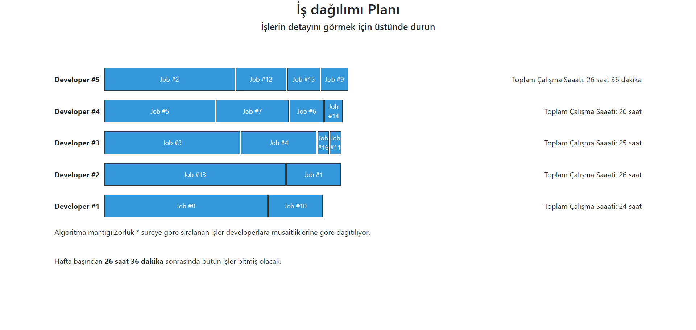

### Job Planning

This is a small laravel project that gets lists of jobs from an api and then distrubutes them to developers in a way that all tasks are completed in the total shortest time possible.

A Job has a difficulty and duration value. A Developer is able to work an x amount of work in a hour which is derived from this table. In the project it is labeled as hourly_rate.

| Developer | Süre | Zorluk |
|-----------|------|--------|
| DEV1      | 1h   | 1x     |
| DEV2      | 1h   | 2x     |
| DEV3      | 1h   | 3x     |
| DEV4      | 1h   | 4x     |
| DEV5      | 1h   | 5x     |

Workload of each job is calculated by multiplying the difficulty of the job by the duration of the job.

Afterwards for each job we sort developers by how many hours they would be left with if they were to work on that job. 

This helps us to find both a developer that will finish the job in a short time and also since we look at the overall leftover weekly time of developers we make sure that we are not overworking any of them.




### Installation


```bash
composer install

php artisan migrate
php artisan db:seed

php artisan app:pull-jobs

php artisan serve
```
